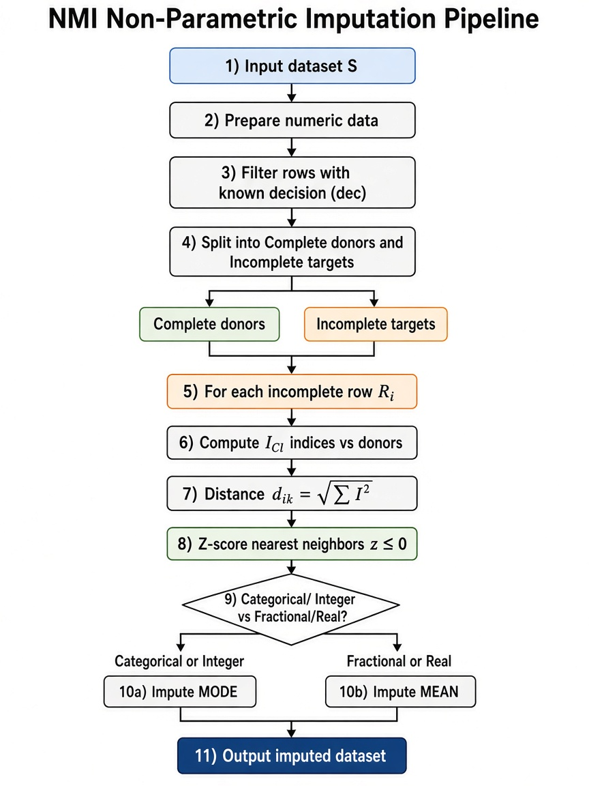
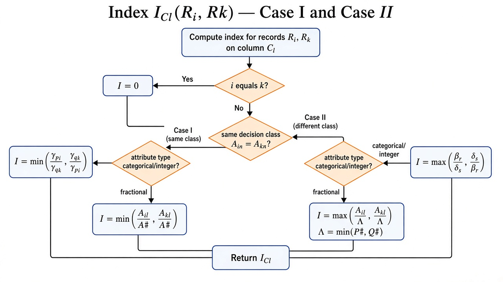
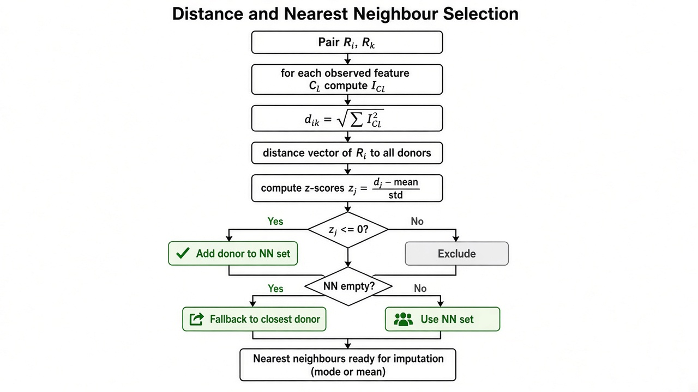
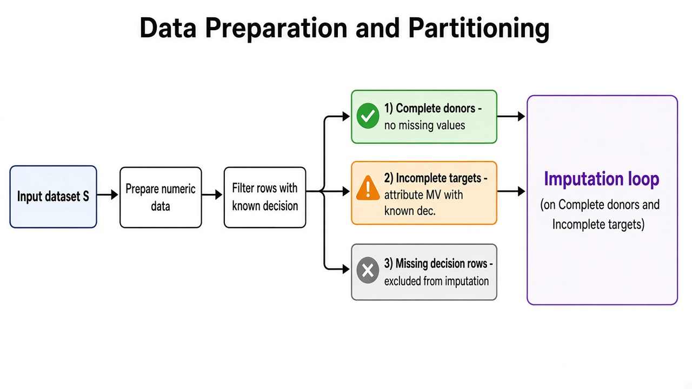

# Non-Parametric Imputation Algorithm — Flowcharts

Pictorial flowcharts for the **New Method Imputation (NMI)** pipeline implemented in `nmilib.py` (`non_parametric_imputation`).

**Dataset conventions**

- Records R₁ … Rₘ; attributes C₁ … Cₙ₋₁; decision Cₙ (`dec`)
- Missing values in input files are encoded as `?`
- Rows with missing **decision** are not imputed

Diagram and formula images live in [`images/`](images/).  
Formulas are shown as **images** so any Markdown viewer displays them correctly (no LaTeX plugin required).

---

## 1. Overall imputation pipeline

**Steps**

1. Prepare numeric data  
2. Keep rows with known decision (`dec`)  
3. Split into **complete donors** and **incomplete targets**  
4. For each incomplete row Rᵢ: compute indices → distances → z-score neighbours  
5. Impute **mode** (categorical/integer) or **mean** (fractional/real)  
6. Return the imputed dataset  

---

## 2. Index ICl(Rᵢ, Rₖ) — Case I and Case II

### Case I — same decision class

**Categorical / integer**

**Fractional / real**

### Case II — different decision classes

**Categorical / integer**

**Fractional / real**

P# and Q# are class-wise means of the **l-th column** \(C_l\) (excluding MV in column \(l\)).  
The paper text that says “average of the **first** column entries” is treated as a wording error: numerators use \(A_{il}, A_{kl}\) and MV exclusion is defined on the \(l\)-th column, so the averages must be over column \(l\).

### Same record

| Branch | Attribute type | Plain-text summary |
|--------|----------------|--------------------|
| Case I (same decision) | categorical / integer | min(γ_pi / γ_qk, γ_qk / γ_pi) |
| Case I | fractional / real | min(A_il / A#, A_kl / A#) |
| Case II (different decision) | categorical / integer | max(β_r / δ_s, δ_s / β_r) |
| Case II | fractional / real | max(A_il / Λ, A_kl / Λ), Λ = min(P#, Q#) |
| i = k | — | I = 0 |

---

## 3. Distance and nearest-neighbour selection

**Distance**

**Z-score**

Nearest neighbours: donors with zⱼ ≤ 0 (fallback: closest donor if the set is empty).

---

## 4. Data preparation and partitioning

| Partition | Rule | Role |
|-----------|------|------|
| Complete donors | No missing values | Source of imputed values |
| Incomplete targets | Attribute MV, known `dec` | Rows to impute |
| Missing decision | `dec` is `?` / NA | Excluded from imputation |

---

## 5. Symbol reference

| Symbol | Meaning |
|--------|---------|
| S | Full dataset |
| Rᵢ, Rₖ | Records (rows) |
| Cₗ | Attribute column l |
| A_in | Decision value of record i |
| ICₗ | Indexing / proximity measure on column l |
| d_ik | Distance between records i and k |
| z(d) | Standardized distance score |
| γ, β, δ | Cardinalities of value groups within decision classes |
| A#, P#, Q# | Column means (overall or class-wise) |
| NN | Nearest neighbours with z ≤ 0 |

---

## 6. Related code

| Step | Function |
|------|----------|
| Entry point | `non_parametric_imputation` |
| Index cases | `compute_case1_categorical`, `compute_case1_fractions`, `compute_case2_categorical`, `compute_case2_fractions` |
| Distance | `pairwise_distance`, `compute_ic` |
| Z-score / NN | `compute_zd`, `get_nearest_neighbors` |
| Fill value | `_impute_from_neighbors` |

---

## Image files

| Diagram / formula | File |
|-------------------|------|
| Overall pipeline | [`images/nmi_pipeline_overview.png`](images/nmi_pipeline_overview.png) |
| Index Case I / II | [`images/nmi_index_cases.png`](images/nmi_index_cases.png) |
| Distance & NN | [`images/nmi_distance_nn.png`](images/nmi_distance_nn.png) |
| Data partitioning | [`images/nmi_data_partition.png`](images/nmi_data_partition.png) |
| Case I categorical | [`images/formula_case1_cat.png`](images/formula_case1_cat.png) |
| Case I fractional | [`images/formula_case1_frac.png`](images/formula_case1_frac.png) |
| Case II categorical | [`images/formula_case2_cat.png`](images/formula_case2_cat.png) |
| Case II fractional | [`images/formula_case2_frac.png`](images/formula_case2_frac.png) |
| Distance | [`images/formula_distance.png`](images/formula_distance.png) |
| Z-score | [`images/formula_zscore.png`](images/formula_zscore.png) |
